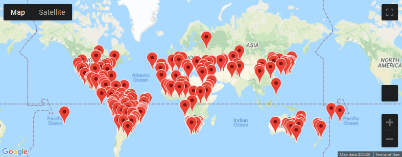
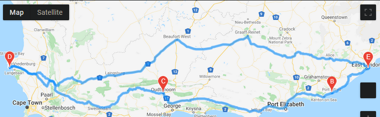
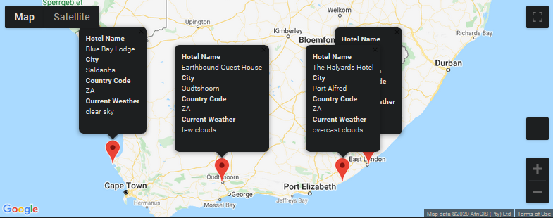

# World_Weather_Analysis
## Overview
### In this project, we generated 2,000 random coordinates. Once the coordinates are gathered, and the API for Open Weather Map was called the information was stored in a dataframe. After exporting the information into a csv, we asked the user for minimum and maximum temperature criteria for their vacation. Using that criteria, we made a new dataframe holding those cities. Next making a call to the Google Maps API. We also need to make a travel itinerary map.
## Vacation Map Based on Weather

## Vacation Travel Itinerary Map Waypoints 

## Vacation Travel Itinerary Map Pop-up Menus

